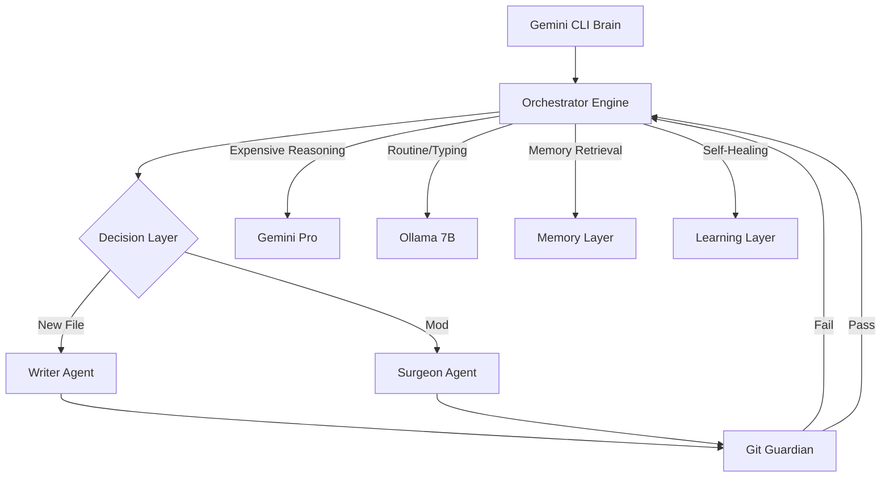

# Arnold Architecture: The Autonomous Coding Agent

*Version 0.1 — Planning Document*
*Date: May 27, 2026*

---

## Core Philosophy

> "Gemini thinks. Ollama types. Arnold ships."

Gemini is not just a model in Arnold — it IS the runtime. It drives every decision,
calls every tool, and never steps away from a task until it's done or has a clear reason
to stop. Ollama models are disposable workers Gemini calls to generate specific code
blocks. The human is an optional collaborator, not a required approver.

---

## The Fundamental Shift from LocalClaw

**LocalClaw architecture:**
```
Task → Planner generates static JSON plan → Executor blindly runs steps in order
       (Gemini plans ONCE and steps away)
```

**Arnold architecture:**
```
Task → Gemini enters a tool loop
       Gemini decides next tool → Arnold executes → result returned to Gemini
       Gemini decides next tool → Arnold executes → result returned to Gemini
       ... (continuous until done or blocked)
       Gemini never steps away
```

This is the same pattern modern high-performance agents use. The model drives. The runtime executes.

---

## System Diagram



---

## Core Modules & Responsibilities

### 1. Orchestration Layer (`src/brain/geminiDriver.js`)

The heart of Arnold. Replaces the Orchestrator, Planner, and Executor from LocalClaw.

**What it does:**
- Opens a Gemini multi-turn session (function calling mode).
- Hands Gemini the task description + all available tools.
- Runs a `while (!done)` loop: send → receive tool call → execute → return result.
- Monitors token budget via `TokenBudget`; compacts context at 70%.
- On task completion: extracts learnings, updates model performance stats.
- On failure after max retries: parks task, notifies via Telegram.

### 2. FileEditPipeline (`src/agents/`)

A 3-agent pipeline. Gemini calls `call_file_edit(path, objective)` as one tool.
Internally this runs three sub-agents in sequence.

#### 2a. FileEditRouter (`src/agents/fileEditRouter.js`)
**Model:** `llama3.2:3b` (fast, binary decision)
**Logic:** Does `<path>` exist? yes → patch. no → write.

#### 2b. FileWriter (`src/agents/fileWriter.js`)
**Model:** `qwen2.5-coder:7b`
**Action:** Writes full file content via `write_file`.

#### 2c. FilePatcher (`src/agents/filePatcher.js`)
**Model:** `qwen2.5-coder:7b`
**Action:** Uses `replace` tool (exact string match). If file > 150 lines: calls `search_files` to locate relevant block.

### 3. GitVerificationAgent (`src/agents/gitVerificationAgent.js`)
**Model:** `qwen2.5-coder:7b` (Ollama)
**Runs after every file edit**
**Logic:**
1. `git diff` → review change.
2. Language-appropriate syntax check.
3. Run tests.
4. If pass: `git add <file>` + `git commit`.
5. If fail: attempt self-repair (re-run patcher), max 2 attempts.

---

## Multi-Model Pipeline Strategy

| Decision | Model | Cost |
|----------|-------|------|
| Architecture, routing, complex reasoning | Gemini 1.5 Pro | Optimized |
| Surgical editing, routine verification | Gemini 1.5 Flash | Cheap |
| Routine code generation | Ollama qwen2.5-coder:7b | Free |
| Write vs patch routing | Ollama llama3.2:3b | Free |
| Git verification, syntax, tests | Ollama qwen2.5-coder:7b | Free |

---

## Project Structure

```
Arnold/
├── src/
│   ├── brain/          # GeminiDriver (core loop)
│   ├── agents/         # FileEditRouter, Writer, Patcher, GitGuardian
│   ├── intelligence/   # ModelPerformanceTracker, SkillGenerator, TokenBudget
│   ├── memory/         # Exact artifacts, knowledge graph, RAG, retention, soul
│   ├── tools/          # Tool registry (all tools Gemini can call)
│   ├── skills/         # Skill manager
│   ├── control/        # HTTP API, React dashboard bridge
│   └── db/             # Persistence layer
├── skills/
│   └── builtin/        # 8 ported and improved skills
├── docs/
│   ├── ARCHITECTURE.md     # Full technical specification
│   └── TRANSITION_RATIONALE.md # Why Arnold replaced LocalClaw
└── db/
    └── migrations/         # Migration scripts
```
